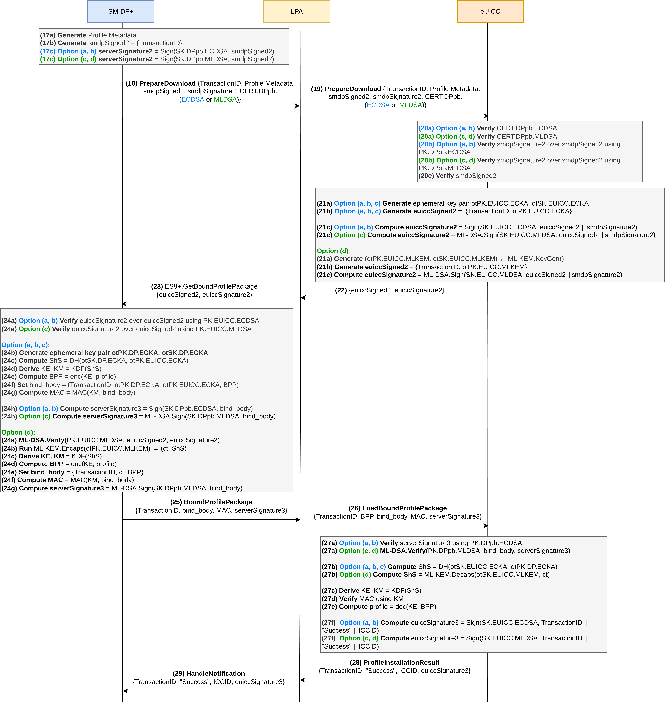

# PQ-RSP

ProVerif models of the **GSMA SGP.22** consumer Remote SIM Provisioning (RSP) protocol: mutual authentication (Phase 1) and profile download (Phase 2) between **SM-DP+** and **eUICC**, with the **LPA** as relay where modeled.

## Contents

| File | Role |
|------|------|
| [protocol-details.md](protocol-details.md) | Protocol step reference and ProVerif modeling notes (notation, options, security goals) |
| [pv-models/option_a.pv](pv-models/option_a.pv) | Classical baseline: ECDSA + ECDH |
| [pv-models/option_b.pv](pv-models/option_b.pv) | Same as (a); ES9+ modeled as PQ-TLS via private channel + LPA relay |
| [pv-models/option_c.pv](pv-models/option_c.pv) | ML-DSA signatures + ECDH |
| [pv-models/option_d.pv](pv-models/option_d.pv) | Full PQC: ML-DSA + ML-KEM (`bind_body` uses KEM ciphertext, not EC keys) |

Each `.pv` file is self-contained (no includes).

## Diagrams

Sequence diagrams for consumer RSP (SGP.22-style flows):

| File | Phase |
|------|--------|
| [CONSUMER-RSP-auth.png](diagrams/CONSUMER-RSP-auth.png) | Phase 1 — mutual authentication (challenge, `AuthenticateServer` / `AuthenticateClient`) |
| [CONSUMER-RSP-download.png](diagrams/CONSUMER-RSP-download.png) | Phase 2 — profile download (`PrepareDownload`, `GetBoundProfilePackage`, `LoadBoundProfilePackage`) |




## Verification

Requires [ProVerif](https://proverif.inria.fr/) (tested with 2.05).

```bash
proverif pv-models/option_a.pv
proverif pv-models/option_b.pv
proverif pv-models/option_c.pv
proverif pv-models/option_d.pv
```

Each model declares correspondence, secrecy, and binding queries aligned with `protocol-details.md` (mutual auth, session/profile secrecy, install binding, forward-secrecy-style phase checks).
